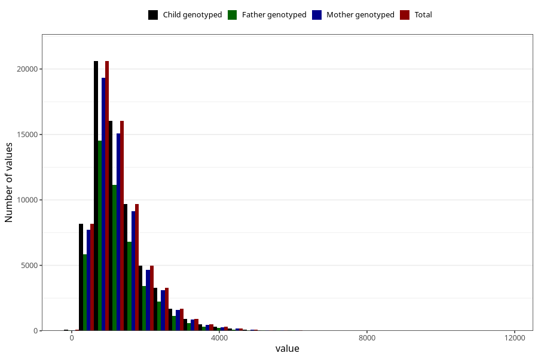

# total_retinol
Variable mapping to `RET_EKVIV` in `Skjema2_beregning_CDW_v12`.
- Number of values:

| Value | Total | Child genotyped | Mother genotyped | Father genotyped |
| ----- | ----- | --------------- | ---------------- | ---------------- |
| Missing | 14322 | 14322 | 13583 | 6707 |
| Non-missing | 66701 | 66701 | 62646 | 46604 |
| 25th percentile | 769.48 | 769.48 | 769.985 | 764.9975 |
| 50th percentile | 1106.99 | 1106.99 | 1107.38 | 1098.895 |
| 75th percentile | 1593.83 | 1593.83 | 1594.34 | 1580.5275 |
| Mean | 1289.83947841861 | 1289.83947841861 | 1289.34016409667 | 1279.19651832461 |
| Standard deviation | 752.842157048261 | 752.842157048261 | 751.233395162969 | 745.445747820256 |
| N | 66701 | 66701 | 62646 | 46604 |

