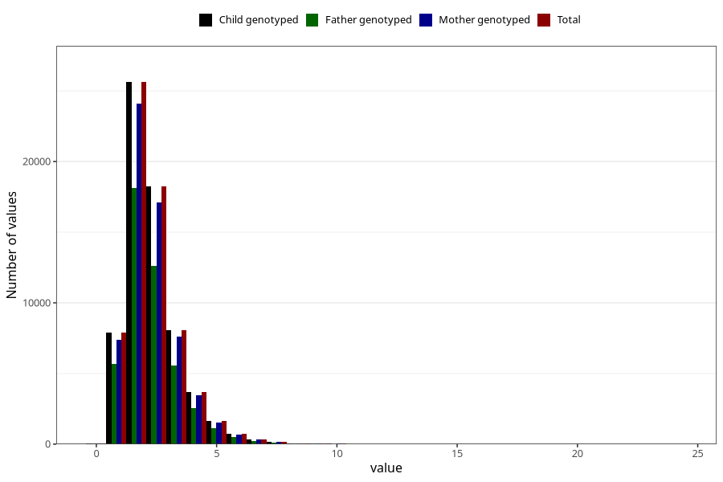

# trans_fatty_acids
Variable mapping to `TOT_TRANS` in `Skjema2_beregning_CDW_v12`.
- Number of values:

| Value | Total | Child genotyped | Mother genotyped | Father genotyped |
| ----- | ----- | --------------- | ---------------- | ---------------- |
| Missing | 14322 | 14322 | 13583 | 6707 |
| Non-missing | 66701 | 66701 | 62646 | 46604 |
| 25th percentile | 1.54 | 1.54 | 1.54 | 1.53 |
| 50th percentile | 2.07 | 2.07 | 2.07 | 2.05 |
| 75th percentile | 2.79 | 2.79 | 2.79 | 2.77 |
| Mean | 2.31968186384012 | 2.31968186384012 | 2.318337164384 | 2.29839284181615 |
| Standard deviation | 1.16157229075247 | 1.16157229075247 | 1.15805935164263 | 1.1388658349775 |
| N | 66701 | 66701 | 62646 | 46604 |

