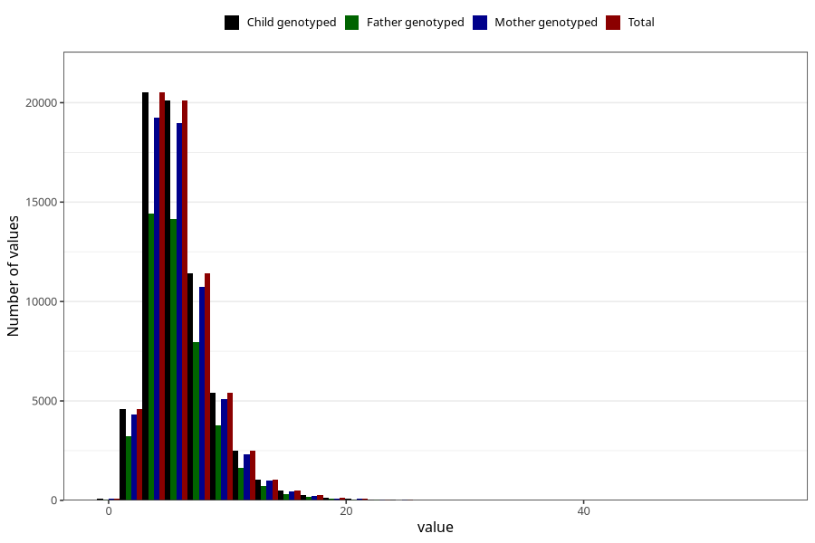

# vitamin_b12
Variable mapping to `VIT_B12` in `Skjema2_beregning_CDW_v12`.
- Number of values:

| Value | Total | Child genotyped | Mother genotyped | Father genotyped |
| ----- | ----- | --------------- | ---------------- | ---------------- |
| Missing | 14322 | 14322 | 13583 | 6707 |
| Non-missing | 66701 | 66701 | 62646 | 46604 |
| 25th percentile | 4.05 | 4.05 | 4.06 | 4.04 |
| 50th percentile | 5.43 | 5.43 | 5.42 | 5.41 |
| 75th percentile | 7.29 | 7.29 | 7.28 | 7.25 |
| Mean | 5.99388359994603 | 5.99388359994603 | 5.98957251859656 | 5.95514226246674 |
| Standard deviation | 2.84320978366829 | 2.84320978366829 | 2.83587917092276 | 2.78727184021253 |
| N | 66701 | 66701 | 62646 | 46604 |

