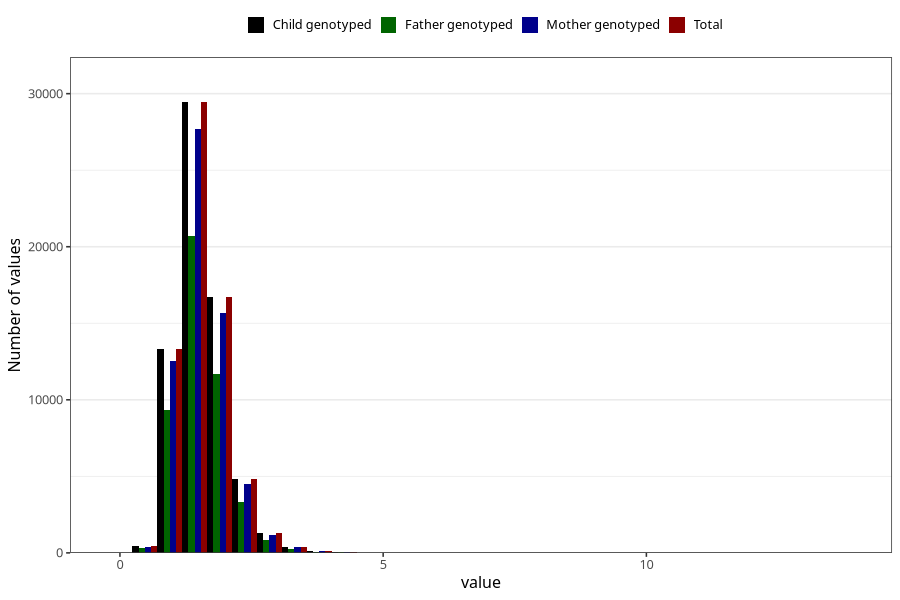

# vitamin_b6
Variable mapping to `VIT_B6` in `Skjema2_beregning_CDW_v12`.
- Number of values:

| Value | Total | Child genotyped | Mother genotyped | Father genotyped |
| ----- | ----- | --------------- | ---------------- | ---------------- |
| Missing | 14322 | 14322 | 13583 | 6707 |
| Non-missing | 66701 | 66701 | 62646 | 46604 |
| 25th percentile | 1.23 | 1.23 | 1.23 | 1.23 |
| 50th percentile | 1.49 | 1.49 | 1.49 | 1.49 |
| 75th percentile | 1.79 | 1.79 | 1.79 | 1.79 |
| Mean | 1.55811936852521 | 1.55811936852521 | 1.55713341633943 | 1.55209574285469 |
| Standard deviation | 0.499153083235559 | 0.499153083235559 | 0.497156855774367 | 0.485966929525893 |
| N | 66701 | 66701 | 62646 | 46604 |

