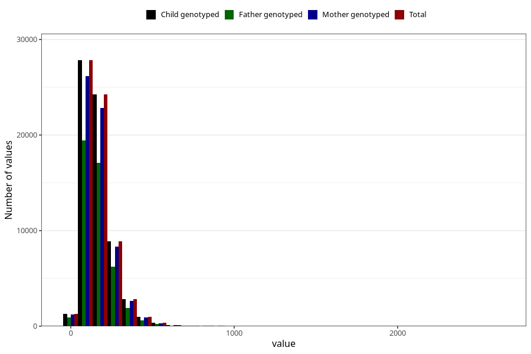

# vitamin_c
Variable mapping to `ASKORBIN` in `Skjema2_beregning_CDW_v12`.
- Number of values:

| Value | Total | Child genotyped | Mother genotyped | Father genotyped |
| ----- | ----- | --------------- | ---------------- | ---------------- |
| Missing | 14322 | 14322 | 13583 | 6707 |
| Non-missing | 66701 | 66701 | 62646 | 46604 |
| 25th percentile | 101.77 | 101.77 | 101.79 | 101.8 |
| 50th percentile | 146.72 | 146.72 | 146.71 | 146.54 |
| 75th percentile | 206.29 | 206.29 | 206.05 | 205.16 |
| Mean | 166.164018830302 | 166.164018830302 | 165.958464067937 | 165.08618852459 |
| Standard deviation | 97.2634228271176 | 97.2634228271176 | 96.6566105688419 | 94.9635548124589 |
| N | 66701 | 66701 | 62646 | 46604 |

