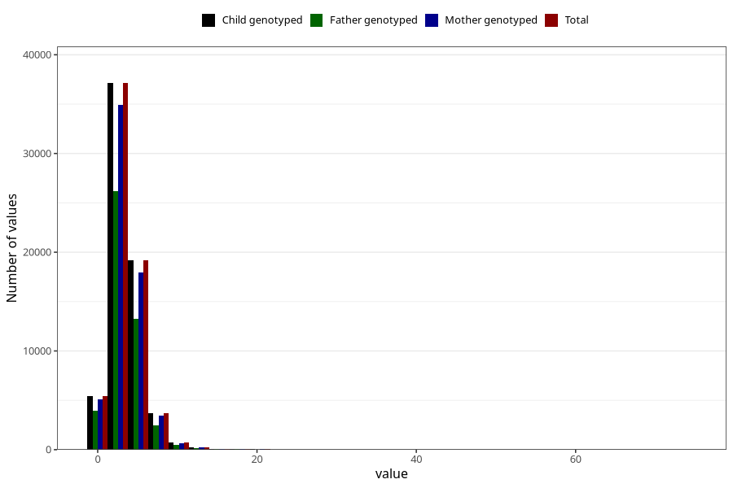

# vitamin_d
Variable mapping to `VIT_D` in `Skjema2_beregning_CDW_v12`.
- Number of values:

| Value | Total | Child genotyped | Mother genotyped | Father genotyped |
| ----- | ----- | --------------- | ---------------- | ---------------- |
| Missing | 14322 | 14322 | 13583 | 6707 |
| Non-missing | 66701 | 66701 | 62646 | 46604 |
| 25th percentile | 2.13 | 2.13 | 2.13 | 2.11 |
| 50th percentile | 3.19 | 3.19 | 3.19 | 3.15 |
| 75th percentile | 4.44 | 4.44 | 4.44 | 4.4 |
| Mean | 3.55345706960915 | 3.55345706960915 | 3.54821137822048 | 3.50492361170715 |
| Standard deviation | 2.38456491945328 | 2.38456491945328 | 2.38245482305043 | 2.36206938220879 |
| N | 66701 | 66701 | 62646 | 46604 |

