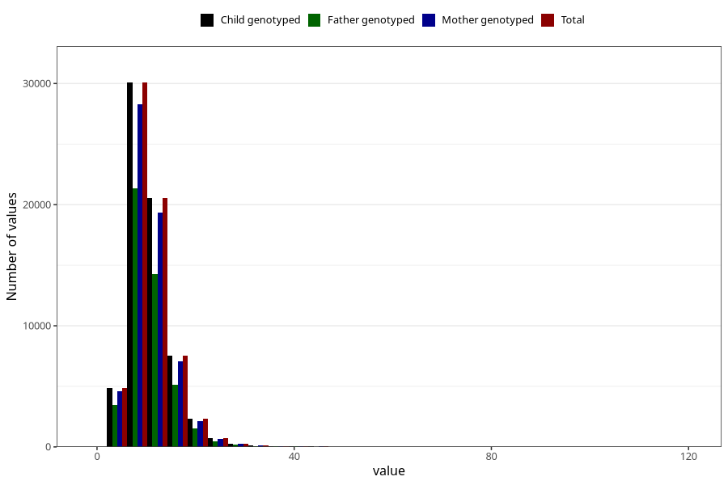

# vitamin_ed
Variable mapping to `VIT_E` in `Skjema2_beregning_CDW_v12`.
- Number of values:

| Value | Total | Child genotyped | Mother genotyped | Father genotyped |
| ----- | ----- | --------------- | ---------------- | ---------------- |
| Missing | 14322 | 14322 | 13583 | 6707 |
| Non-missing | 66701 | 66701 | 62646 | 46604 |
| 25th percentile | 7.95 | 7.95 | 7.94 | 7.9 |
| 50th percentile | 10 | 10 | 10 | 9.94 |
| 75th percentile | 12.8 | 12.8 | 12.79 | 12.69 |
| Mean | 10.9021305527653 | 10.9021305527653 | 10.8939727995403 | 10.8063619002661 |
| Standard deviation | 4.59101316834871 | 4.59101316834871 | 4.58961631207716 | 4.49304761561358 |
| N | 66701 | 66701 | 62646 | 46604 |

