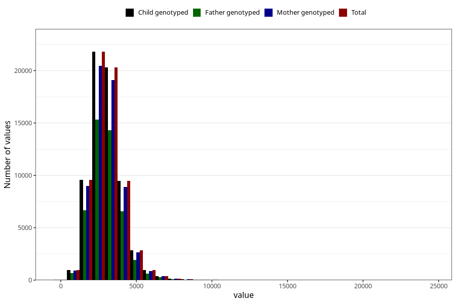

# water_g
Variable mapping to `VANN_G` in `Skjema2_beregning_CDW_v12`.
- Number of values:

| Value | Total | Child genotyped | Mother genotyped | Father genotyped |
| ----- | ----- | --------------- | ---------------- | ---------------- |
| Missing | 14322 | 14322 | 13583 | 6707 |
| Non-missing | 66701 | 66701 | 62646 | 46604 |
| 25th percentile | 2349.2 | 2349.2 | 2349.925 | 2350.365 |
| 50th percentile | 2959.23 | 2959.23 | 2958.87 | 2957.165 |
| 75th percentile | 3620.9 | 3620.9 | 3618.3475 | 3609.2425 |
| Mean | 3067.21268301825 | 3067.21268301825 | 3065.68875331226 | 3058.16277036306 |
| Standard deviation | 1078.25986198792 | 1078.25986198792 | 1077.15097010226 | 1055.90607868101 |
| N | 66701 | 66701 | 62646 | 46604 |

