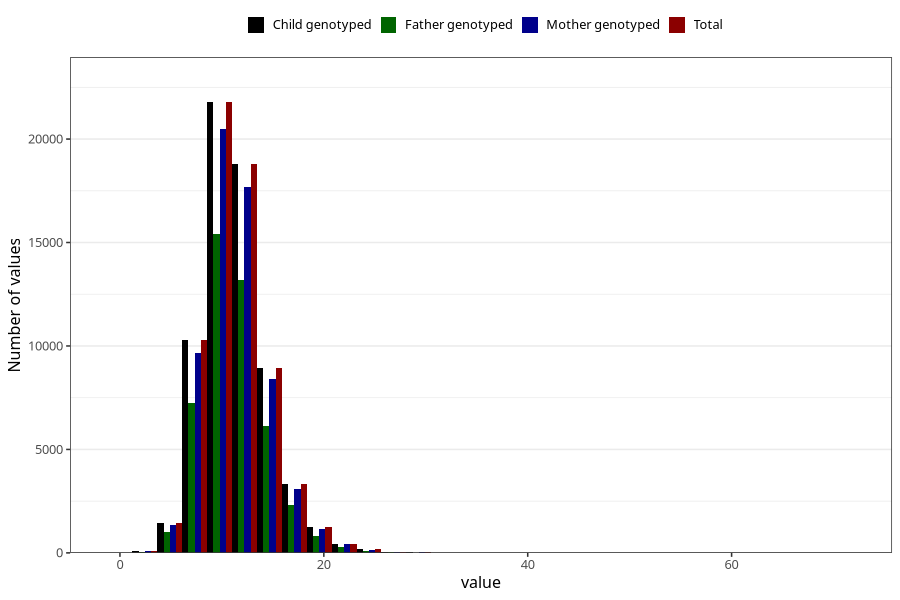

# zinc
Variable mapping to `SINK` in `Skjema2_beregning_CDW_v12`.
- Number of values:

| Value | Total | Child genotyped | Mother genotyped | Father genotyped |
| ----- | ----- | --------------- | ---------------- | ---------------- |
| Missing | 14322 | 14322 | 13583 | 6707 |
| Non-missing | 66701 | 66701 | 62646 | 46604 |
| 25th percentile | 9.18 | 9.18 | 9.18 | 9.16 |
| 50th percentile | 10.97 | 10.97 | 10.97 | 10.94 |
| 75th percentile | 13.03 | 13.03 | 13.02 | 12.97 |
| Mean | 11.3520932219907 | 11.3520932219907 | 11.3471085145101 | 11.298796240666 |
| Standard deviation | 3.28507394859557 | 3.28507394859557 | 3.27586042271035 | 3.20997732201513 |
| N | 66701 | 66701 | 62646 | 46604 |

