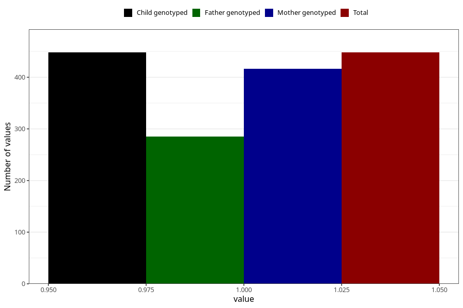

# contraception_used_hormone_injection
Variable mapping to `AA32` in `Skjema1_v12`.
- Number of values:

| Value | Total | Child genotyped | Mother genotyped | Father genotyped |
| ----- | ----- | --------------- | ---------------- | ---------------- |
| Missing | 80575 | 80575 | 75813 | 53026 |
| Non-missing | 448 | 448 | 416 | 285 |
| 1 | 448 | 448 | 416 | 285 |

