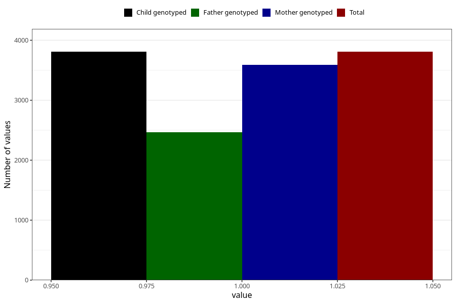

# contraception_used_hormone_iud
Variable mapping to `AA31` in `Skjema1_v12`.
- Number of values:

| Value | Total | Child genotyped | Mother genotyped | Father genotyped |
| ----- | ----- | --------------- | ---------------- | ---------------- |
| Missing | 77215 | 77215 | 72640 | 50843 |
| Non-missing | 3808 | 3808 | 3589 | 2468 |
| 1 | 3808 | 3808 | 3589 | 2468 |

