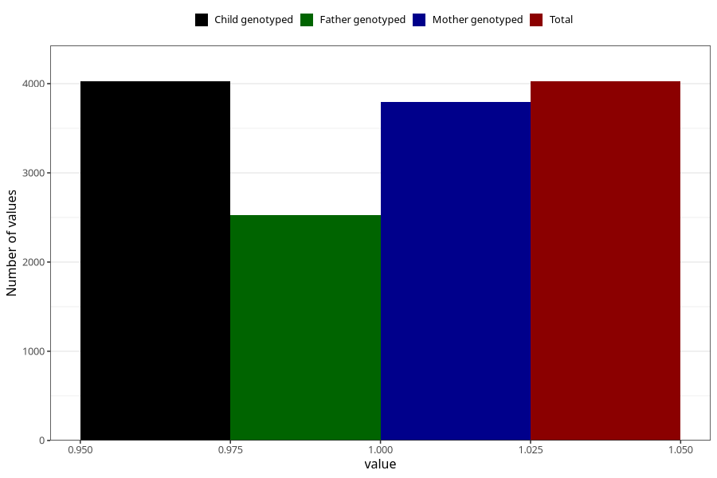

# contraception_used_iud
Variable mapping to `AA30` in `Skjema1_v12`.
- Number of values:

| Value | Total | Child genotyped | Mother genotyped | Father genotyped |
| ----- | ----- | --------------- | ---------------- | ---------------- |
| Missing | 76998 | 76998 | 72437 | 50789 |
| Non-missing | 4025 | 4025 | 3792 | 2522 |
| 1 | 4025 | 4025 | 3792 | 2522 |

