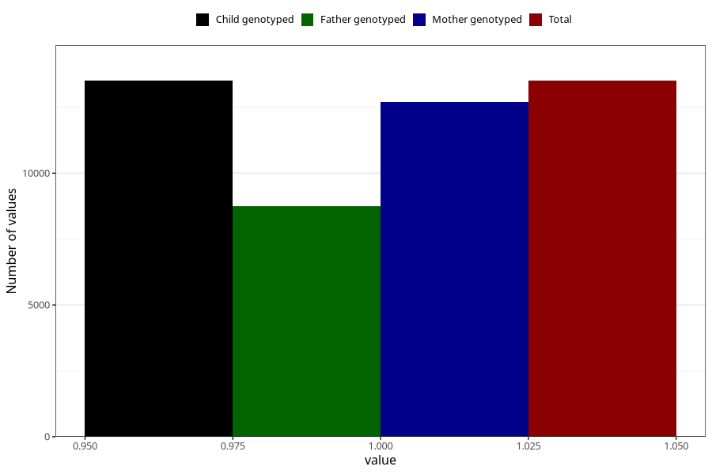

# contraception_used_no_such_method
Variable mapping to `AA38` in `Skjema1_v12`.
- Number of values:

| Value | Total | Child genotyped | Mother genotyped | Father genotyped |
| ----- | ----- | --------------- | ---------------- | ---------------- |
| Missing | 67512 | 67512 | 63523 | 44566 |
| Non-missing | 13511 | 13511 | 12706 | 8745 |
| 1 | 13511 | 13511 | 12706 | 8745 |

