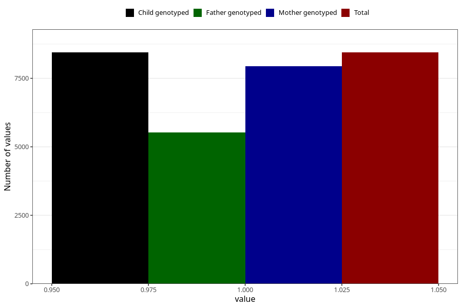

# contraception_used_safe_period
Variable mapping to `AA36` in `Skjema1_v12`.
- Number of values:

| Value | Total | Child genotyped | Mother genotyped | Father genotyped |
| ----- | ----- | --------------- | ---------------- | ---------------- |
| Missing | 72579 | 72579 | 68287 | 47785 |
| Non-missing | 8444 | 8444 | 7942 | 5526 |
| 1 | 8444 | 8444 | 7942 | 5526 |

