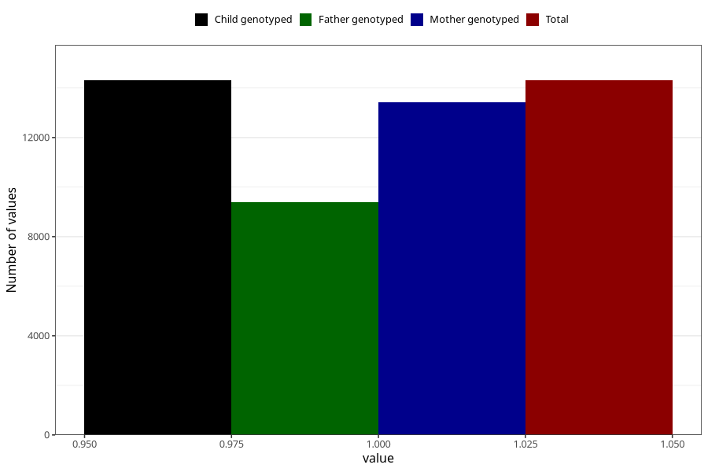

# contraception_used_withdrawal
Variable mapping to `AA37` in `Skjema1_v12`.
- Number of values:

| Value | Total | Child genotyped | Mother genotyped | Father genotyped |
| ----- | ----- | --------------- | ---------------- | ---------------- |
| Missing | 66718 | 66718 | 62795 | 43925 |
| Non-missing | 14305 | 14305 | 13434 | 9386 |
| 1 | 14305 | 14305 | 13434 | 9386 |

