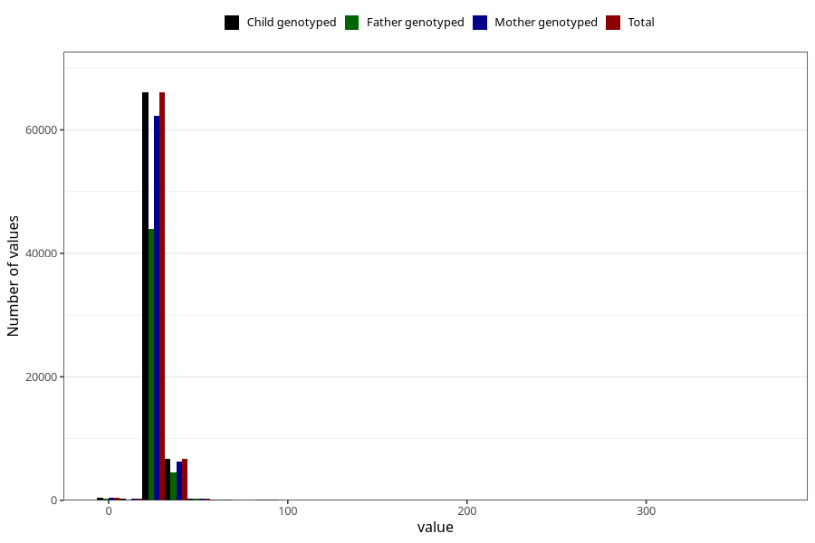

# menstrual_cycle_length
Variable mapping to `AA13` in `Skjema1_v12`.
Variable mapping to `AA13` in `Skjema1_v12`.
- Number of values:

| Value | Total | Child genotyped | Mother genotyped | Father genotyped |
| ----- | ----- | --------------- | ---------------- | ---------------- |
| Missing | 6854 | 6854 | 6406 | 4009 |
| Non-missing | 74169 | 74169 | 69823 | 49302 |
| 25th percentile | 28 | 28 | 28 | 28 |
| 50th percentile | 28 | 28 | 28 | 28 |
| 75th percentile | 30 | 30 | 30 | 30 |
| Mean | 28.5893162911729 | 28.5893162911729 | 28.5852512782321 | 28.6523670439333 |
| Standard deviation | 5.26301102588992 | 5.26301102588992 | 5.24821204335941 | 5.18026384870886 |
| N | 74169 | 74169 | 69823 | 49302 |

