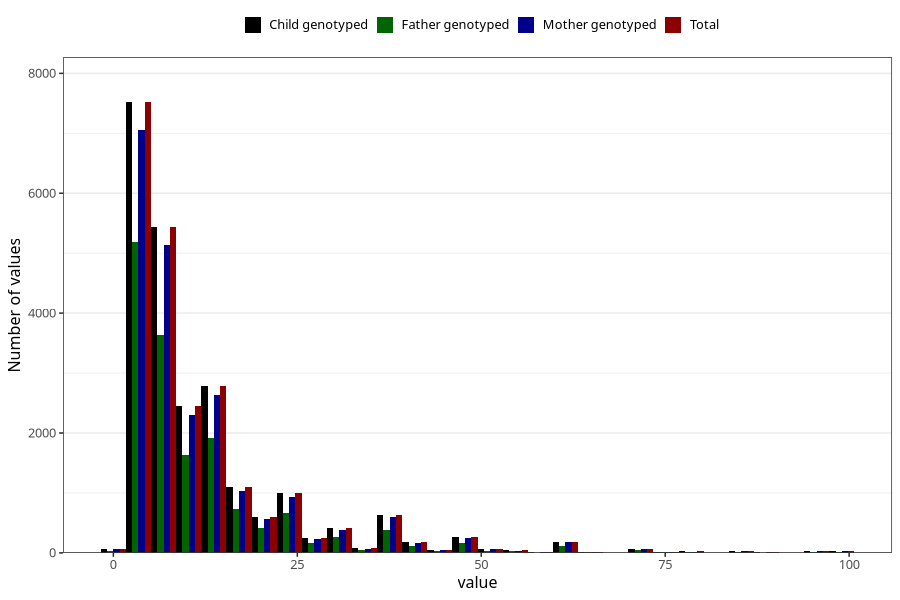

# months_intercourse_without_contraception_2
Variable mapping to `AA48` in `Skjema1_v12`.
- Number of values:

| Value | Total | Child genotyped | Mother genotyped | Father genotyped |
| ----- | ----- | --------------- | ---------------- | ---------------- |
| Missing | 57711 | 57711 | 54284 | 37612 |
| Non-missing | 23312 | 23312 | 21945 | 15699 |
| 25th percentile | 5 | 5 | 5 | 5 |
| 50th percentile | 7 | 7 | 7 | 7 |
| 75th percentile | 14 | 14 | 14 | 13 |
| Mean | 12.1772048730268 | 12.1772048730268 | 12.2091592617908 | 11.9332441556787 |
| Standard deviation | 12.6001644533902 | 12.6001644533902 | 12.6572283751155 | 12.2278607454321 |
| N | 23312 | 23312 | 21945 | 15699 |

