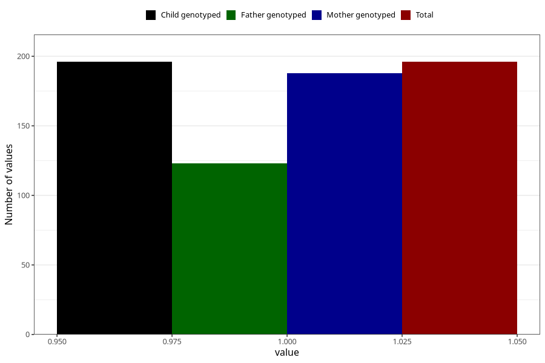

# treated_for_infertility_fallopian_tube_suregery
Variable mapping to `AA69` in `Skjema1_v12`.
- Number of values:

| Value | Total | Child genotyped | Mother genotyped | Father genotyped |
| ----- | ----- | --------------- | ---------------- | ---------------- |
| Missing | 80827 | 80827 | 76041 | 53188 |
| Non-missing | 196 | 196 | 188 | 123 |
| 1 | 196 | 196 | 188 | 123 |

