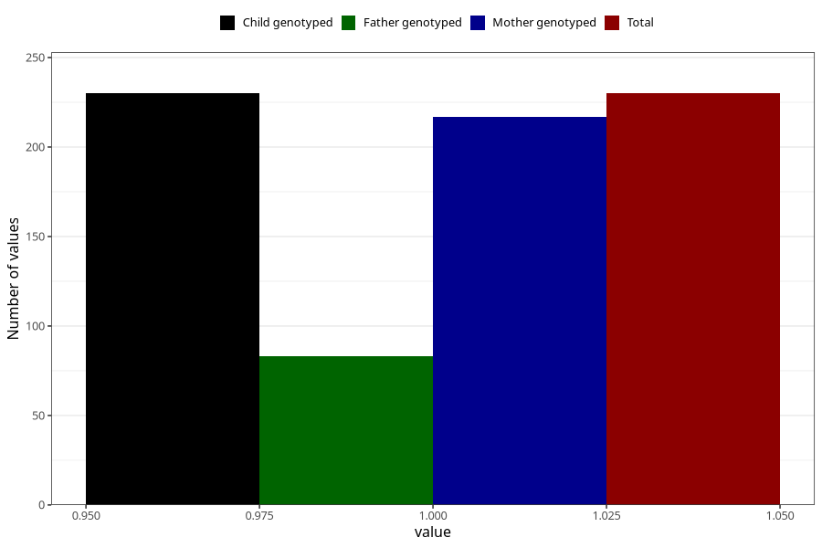

# treated_for_infertility_insemination
Variable mapping to `AA77` in `Skjema1_v12`.
- Number of values:

| Value | Total | Child genotyped | Mother genotyped | Father genotyped |
| ----- | ----- | --------------- | ---------------- | ---------------- |
| Missing | 80793 | 80793 | 76012 | 53228 |
| Non-missing | 230 | 230 | 217 | 83 |
| 1 | 230 | 230 | 217 | 83 |

