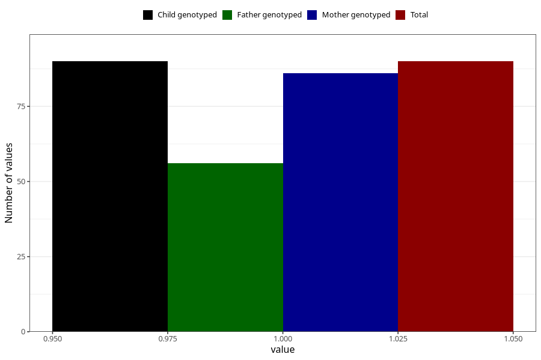

# treated_for_infertility_medication_endometriosis
Variable mapping to `AA73` in `Skjema1_v12`.
- Number of values:

| Value | Total | Child genotyped | Mother genotyped | Father genotyped |
| ----- | ----- | --------------- | ---------------- | ---------------- |
| Missing | 80933 | 80933 | 76143 | 53255 |
| Non-missing | 90 | 90 | 86 | 56 |
| 1 | 90 | 90 | 86 | 56 |

