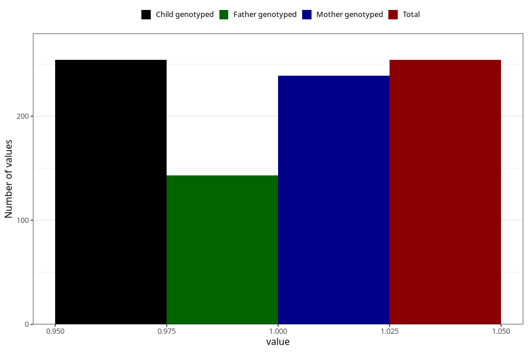

# treated_for_infertility_previous_fallopian_tube_suregery
Variable mapping to `AA68` in `Skjema1_v12`.
- Number of values:

| Value | Total | Child genotyped | Mother genotyped | Father genotyped |
| ----- | ----- | --------------- | ---------------- | ---------------- |
| Missing | 80769 | 80769 | 75990 | 53168 |
| Non-missing | 254 | 254 | 239 | 143 |
| 1 | 254 | 254 | 239 | 143 |

