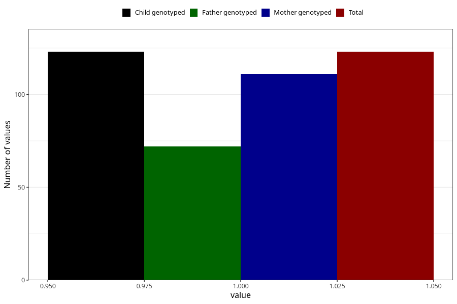

# treated_for_infertility_previous_medication_endometriosis
Variable mapping to `AA72` in `Skjema1_v12`.
- Number of values:

| Value | Total | Child genotyped | Mother genotyped | Father genotyped |
| ----- | ----- | --------------- | ---------------- | ---------------- |
| Missing | 80900 | 80900 | 76118 | 53239 |
| Non-missing | 123 | 123 | 111 | 72 |
| 1 | 123 | 123 | 111 | 72 |

