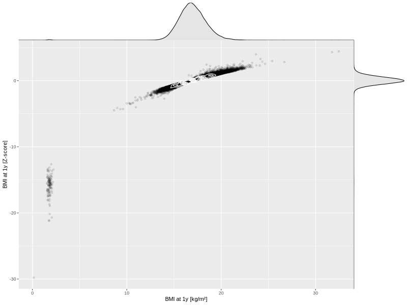

## BMI at 1y

| Name | # Children | # Mothers | # Fathers | # Total |
| ---- | ---------- | --------- | --------- | ------- |
| bmi_1y | 57781 | 54463 | 38784 | 151028 |
| z_bmi_1y | 57775 | 54457 | 38780 | 151012 |

- Formula: `bmi_1y ~ fp(pregnancy_duration_1)`
- Sigma formula: ` ~ pregnancy_duration_1`
- Distribution: `LOGNO`
- Normalization: `centiles.pred` Z-scores

