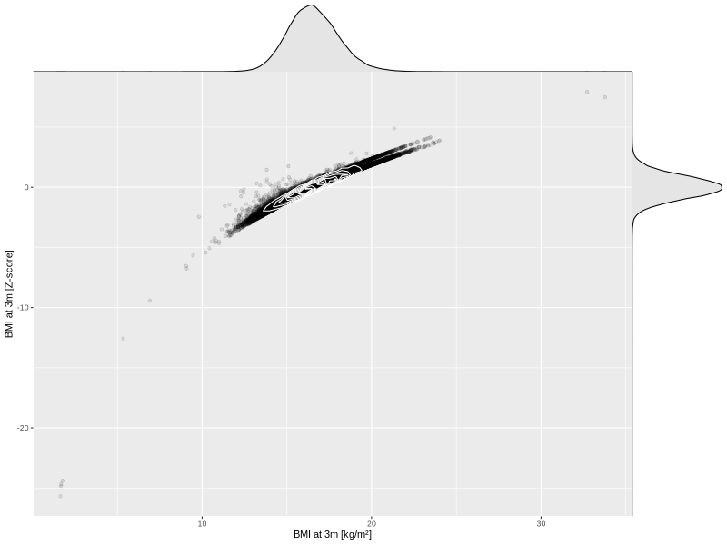

## BMI at 3m

| Name | # Children | # Mothers | # Fathers | # Total |
| ---- | ---------- | --------- | --------- | ------- |
| bmi_3m | 65426 | 61683 | 43661 | 170770 |
| z_bmi_3m | 65423 | 61680 | 43658 | 170761 |

- Formula: `bmi_3m ~ fp(pregnancy_duration_1)`
- Sigma formula: ` ~ pregnancy_duration_1`
- Distribution: `LOGNO`
- Normalization: `centiles.pred` Z-scores

