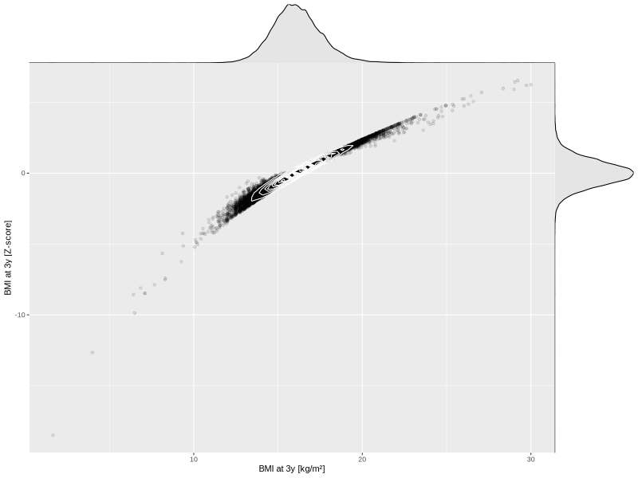

## BMI at 3y

| Name | # Children | # Mothers | # Fathers | # Total |
| ---- | ---------- | --------- | --------- | ------- |
| bmi_3y | 44030 | 41382 | 30553 | 115965 |
| z_bmi_3y | 44028 | 41380 | 30551 | 115959 |

- Formula: `bmi_3y ~ fp(pregnancy_duration_1)`
- Sigma formula: ` ~ pregnancy_duration_1`
- Distribution: `LOGNO`
- Normalization: `centiles.pred` Z-scores

