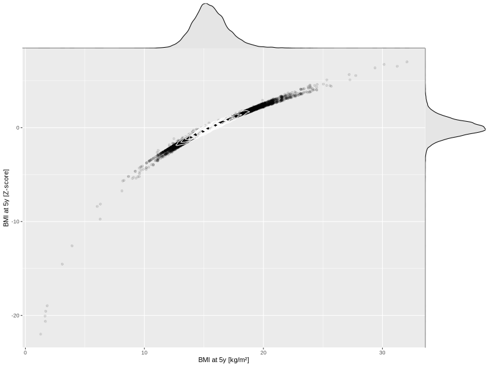

## BMI at 5y

| Name | # Children | # Mothers | # Fathers | # Total |
| ---- | ---------- | --------- | --------- | ------- |
| bmi_5y | 35589 | 33450 | 25230 | 94269 |
| z_bmi_5y | 35588 | 33449 | 25229 | 94266 |

- Formula: `bmi_5y ~ fp(pregnancy_duration_1)`
- Sigma formula: ` ~ pregnancy_duration_1`
- Distribution: `LOGNO`
- Normalization: `centiles.pred` Z-scores

