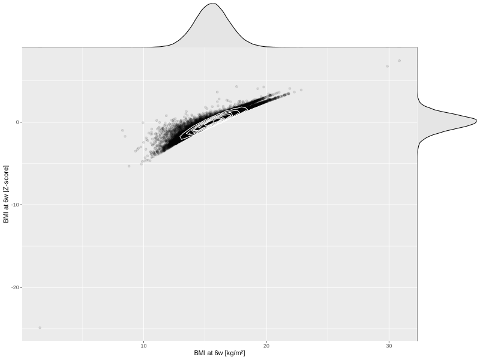

## BMI at 6w

| Name | # Children | # Mothers | # Fathers | # Total |
| ---- | ---------- | --------- | --------- | ------- |
| bmi_6w | 46519 | 43778 | 32255 | 122552 |
| z_bmi_6w | 46516 | 43775 | 32252 | 122543 |

- Formula: `bmi_6w ~ fp(pregnancy_duration_1)`
- Sigma formula: ` ~ pregnancy_duration_1`
- Distribution: `LOGNO`
- Normalization: `centiles.pred` Z-scores

