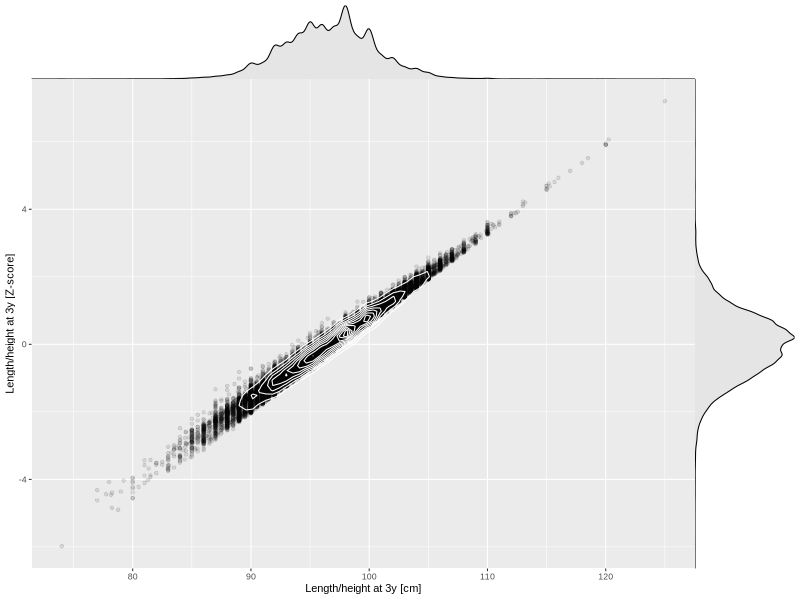

## Length/height at 3y

| Name | # Children | # Mothers | # Fathers | # Total |
| ---- | ---------- | --------- | --------- | ------- |
| length_3y | 45063 | 42371 | 31277 | 118711 |
| z_length_3y | 45054 | 42362 | 31275 | 118691 |

- Formula: `length_3y ~ fp(pregnancy_duration_1)`
- Sigma formula: ` ~ pregnancy_duration_1`
- Distribution: `NO`
- Normalization: `centiles.pred` Z-scores

