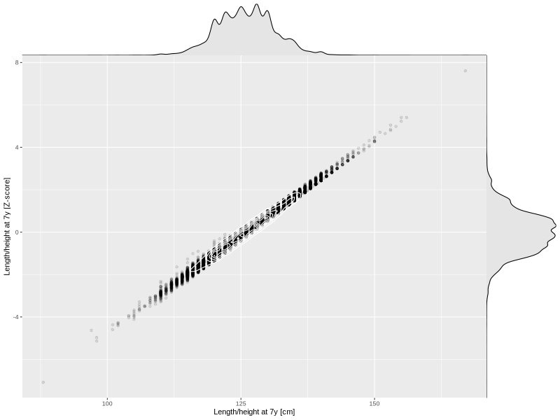

## Length/height at 7y

| Name | # Children | # Mothers | # Fathers | # Total |
| ---- | ---------- | --------- | --------- | ------- |
| length_7y | 38444 | 36214 | 26095 | 100753 |
| z_length_7y | 38442 | 36212 | 26093 | 100747 |

- Formula: `length_7y ~ fp(pregnancy_duration_1)`
- Sigma formula: ` ~ pregnancy_duration_1`
- Distribution: `NO`
- Normalization: `centiles.pred` Z-scores

