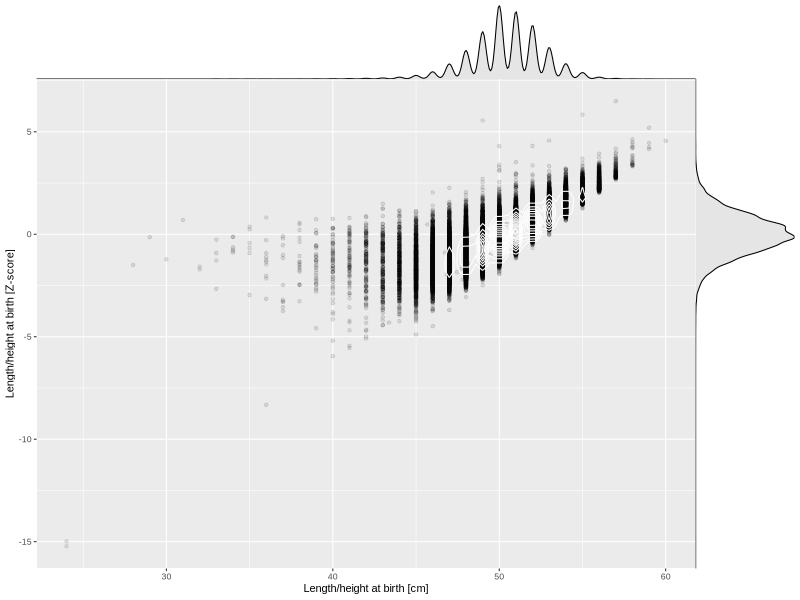

## Length/height at birth

| Name | # Children | # Mothers | # Fathers | # Total |
| ---- | ---------- | --------- | --------- | ------- |
| length_birth | 77890 | 73277 | 51192 | 202359 |
| z_length_birth | 77890 | 73277 | 51192 | 202359 |

- Formula: `length_birth ~ fp(pregnancy_duration_1)`
- Sigma formula: ` ~ pregnancy_duration_1`
- Distribution: `NO`
- Normalization: `centiles.pred` Z-scores

