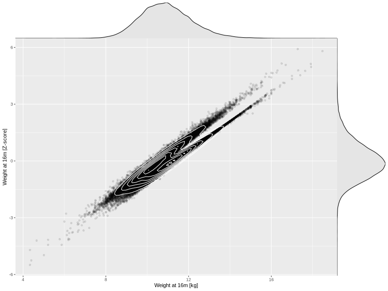

## Weight at 16m

| Name | # Children | # Mothers | # Fathers | # Total |
| ---- | ---------- | --------- | --------- | ------- |
| weight_16m | 44421 | 41797 | 30762 | 116980 |
| z_weight_16m | 44415 | 41791 | 30757 | 116963 |

- Formula: `weight_16m ~ fp(pregnancy_duration_1)`
- Sigma formula: ` ~ pregnancy_duration_1`
- Distribution: `NO`
- Normalization: `centiles.pred` Z-scores

