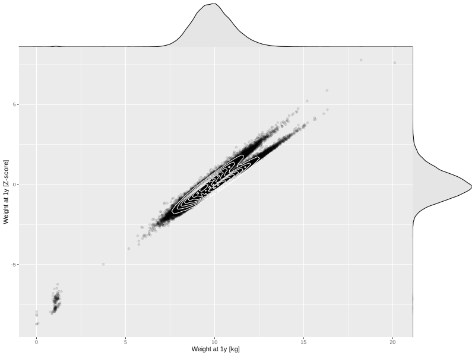

## Weight at 1y

| Name | # Children | # Mothers | # Fathers | # Total |
| ---- | ---------- | --------- | --------- | ------- |
| weight_1y | 58288 | 54944 | 39115 | 152347 |
| z_weight_1y | 58286 | 54942 | 39113 | 152341 |

- Formula: `weight_1y ~ fp(pregnancy_duration_1)`
- Sigma formula: ` ~ pregnancy_duration_1`
- Distribution: `NO`
- Normalization: `centiles.pred` Z-scores

