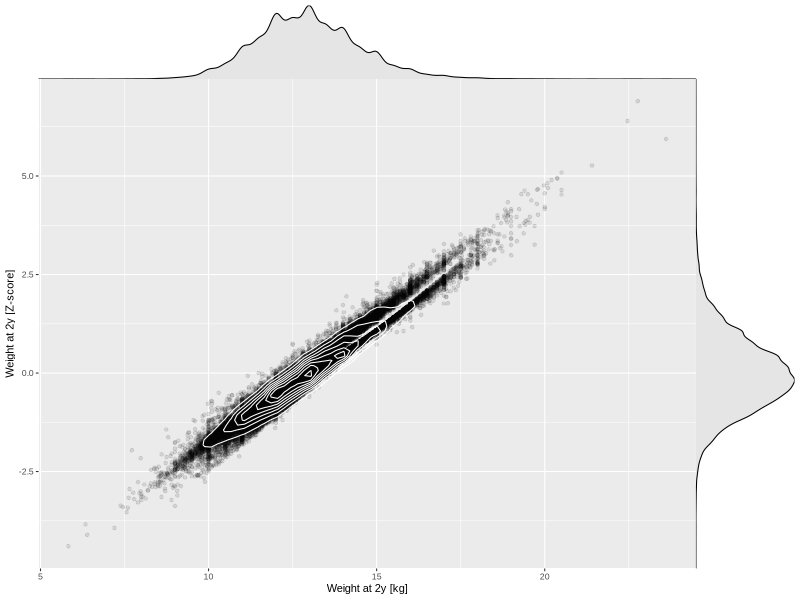

## Weight at 2y

| Name | # Children | # Mothers | # Fathers | # Total |
| ---- | ---------- | --------- | --------- | ------- |
| weight_2y | 44186 | 41574 | 30604 | 116364 |
| z_weight_2y | 44179 | 41567 | 30599 | 116345 |

- Formula: `weight_2y ~ fp(pregnancy_duration_1)`
- Sigma formula: ` ~ pregnancy_duration_1`
- Distribution: `NO`
- Normalization: `centiles.pred` Z-scores

