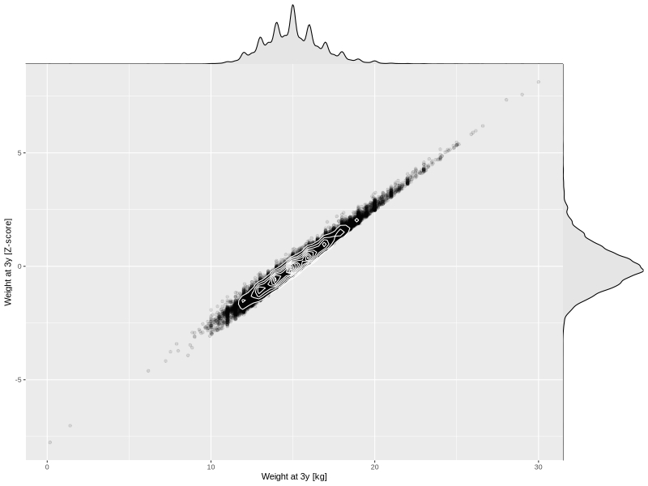

## Weight at 3y

| Name | # Children | # Mothers | # Fathers | # Total |
| ---- | ---------- | --------- | --------- | ------- |
| weight_3y | 45520 | 42774 | 31543 | 119837 |
| z_weight_3y | 45515 | 42770 | 31542 | 119827 |

- Formula: `weight_3y ~ fp(pregnancy_duration_1)`
- Sigma formula: ` ~ pregnancy_duration_1`
- Distribution: `NO`
- Normalization: `centiles.pred` Z-scores

