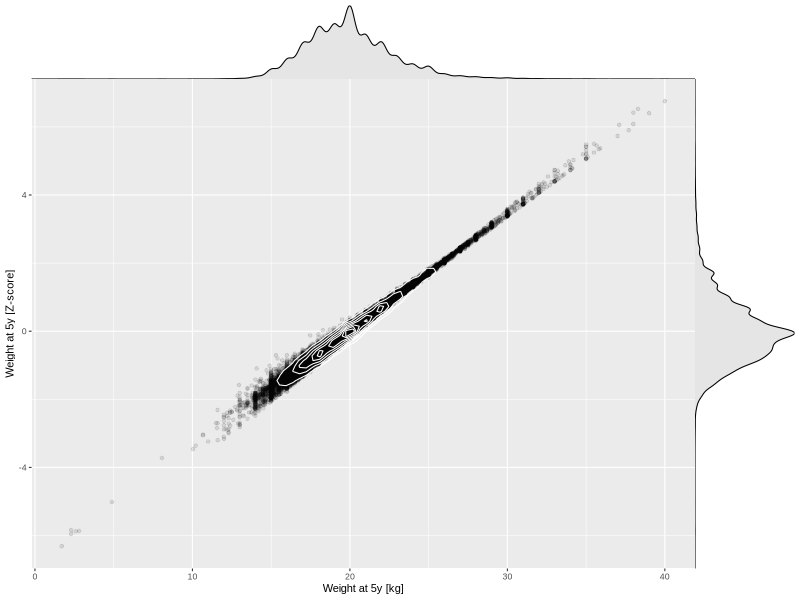

## Weight at 5y

| Name | # Children | # Mothers | # Fathers | # Total |
| ---- | ---------- | --------- | --------- | ------- |
| weight_5y | 36403 | 34202 | 25787 | 96392 |
| z_weight_5y | 36399 | 34199 | 25784 | 96382 |

- Formula: `weight_5y ~ fp(pregnancy_duration_1)`
- Sigma formula: ` ~ pregnancy_duration_1`
- Distribution: `NO`
- Normalization: `centiles.pred` Z-scores

