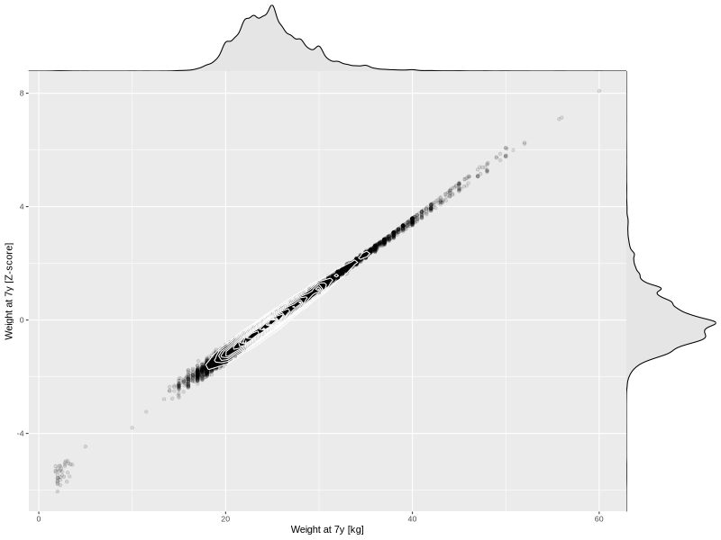

## Weight at 7y

| Name | # Children | # Mothers | # Fathers | # Total |
| ---- | ---------- | --------- | --------- | ------- |
| weight_7y | 37648 | 35455 | 25549 | 98652 |
| z_weight_7y | 37647 | 35454 | 25549 | 98650 |

- Formula: `weight_7y ~ fp(pregnancy_duration_1)`
- Sigma formula: ` ~ pregnancy_duration_1`
- Distribution: `NO`
- Normalization: `centiles.pred` Z-scores

