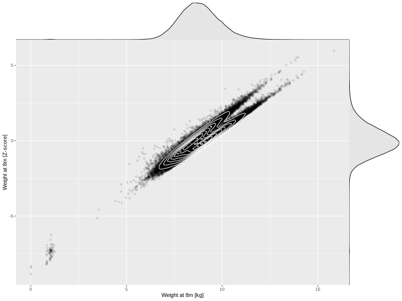

## Weight at 8m

| Name | # Children | # Mothers | # Fathers | # Total |
| ---- | ---------- | --------- | --------- | ------- |
| weight_8m | 58391 | 55048 | 39171 | 152610 |
| z_weight_8m | 58389 | 55046 | 39169 | 152604 |

- Formula: `weight_8m ~ fp(pregnancy_duration_1)`
- Sigma formula: ` ~ pregnancy_duration_1`
- Distribution: `NO`
- Normalization: `centiles.pred` Z-scores

