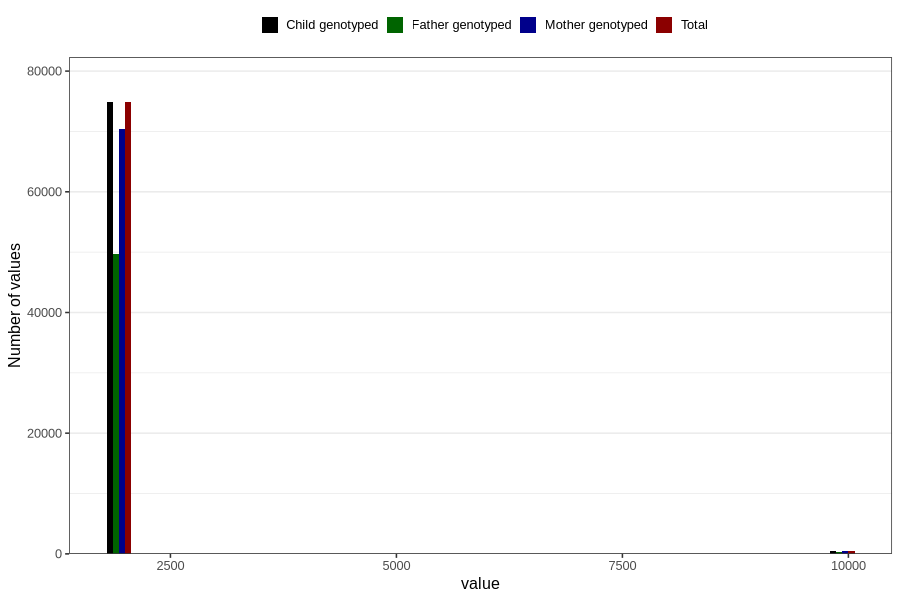

# q1_year_filled
Variable mapping to `AA11` in `Skjema1_v12`.
- Number of values:

| Value | Total | Child genotyped | Mother genotyped | Father genotyped |
| ----- | ----- | --------------- | ---------------- | ---------------- |
| Missing | 5530 | 5530 | 5157 | 3144 |
| Non-missing | 75276 | 75276 | 70867 | 50019 |
| 1999 | 565 | 565 | 542 | 100 |
| 2000 | 1939 | 1939 | 1873 | 497 |
| 2001 | 4287 | 4287 | 4151 | 1791 |
| 2002 | 7636 | 7636 | 7219 | 4766 |
| 2003 | 9524 | 9524 | 8976 | 6373 |
| 2004 | 10272 | 10272 | 9655 | 7173 |
| 2005 | 12317 | 12317 | 11494 | 8809 |
| 2006 | 10917 | 10917 | 10209 | 7885 |
| 2007 | 10548 | 10548 | 9890 | 7364 |
| 2008 | 6764 | 6764 | 6375 | 4930 |
| 2009 | 64 | 64 | 62 | 48 |
| 2044 | 1 | 1 | 1 | 0 |
| 9999 | 442 | 442 | 420 | 283 |

