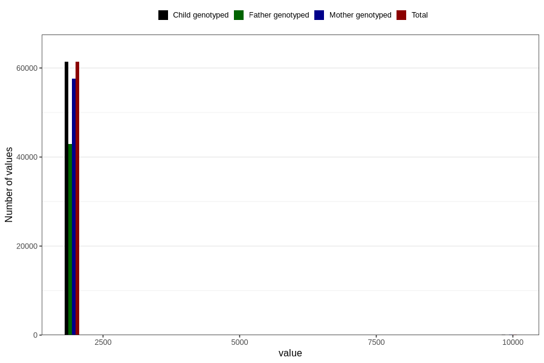

# q2_year_filled
Variable mapping to `BB11` in `Skjema2CDW_v12`.
- Number of values:

| Value | Total | Child genotyped | Mother genotyped | Father genotyped |
| ----- | ----- | --------------- | ---------------- | ---------------- |
| Missing | 19358 | 19358 | 18312 | 10154 |
| Non-missing | 61448 | 61448 | 57712 | 43009 |
| 2000 | 2 | 2 | 2 | 1 |
| 2001 | 51 | 51 | 47 | 34 |
| 2002 | 5983 | 5983 | 5644 | 3826 |
| 2003 | 8765 | 8765 | 8262 | 5871 |
| 2004 | 8694 | 8694 | 8178 | 6071 |
| 2005 | 10844 | 10844 | 10127 | 7772 |
| 2006 | 10349 | 10349 | 9733 | 7524 |
| 2007 | 9379 | 9379 | 8754 | 6523 |
| 2008 | 6798 | 6798 | 6414 | 4980 |
| 2009 | 508 | 508 | 479 | 360 |
| 9999 | 75 | 75 | 72 | 47 |

