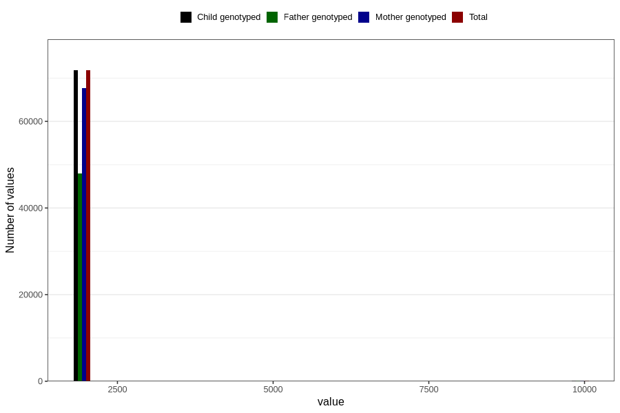

# q3_year_filled
Variable mapping to `CC11` in `Skjema3_v12`.
- Number of values:

| Value | Total | Child genotyped | Mother genotyped | Father genotyped |
| ----- | ----- | --------------- | ---------------- | ---------------- |
| Missing | 8940 | 8940 | 8313 | 5059 |
| Non-missing | 71866 | 71866 | 67711 | 48104 |
| 2000 | 1191 | 1191 | 1154 | 247 |
| 2001 | 3479 | 3479 | 3369 | 1309 |
| 2002 | 6671 | 6671 | 6345 | 3941 |
| 2003 | 9084 | 9084 | 8582 | 5976 |
| 2004 | 10113 | 10113 | 9530 | 7080 |
| 2005 | 11052 | 11052 | 10314 | 7907 |
| 2006 | 10937 | 10937 | 10275 | 7966 |
| 2007 | 10097 | 10097 | 9396 | 6996 |
| 2008 | 7913 | 7913 | 7504 | 5724 |
| 2009 | 1230 | 1230 | 1149 | 896 |
| 9999 | 99 | 99 | 93 | 62 |

