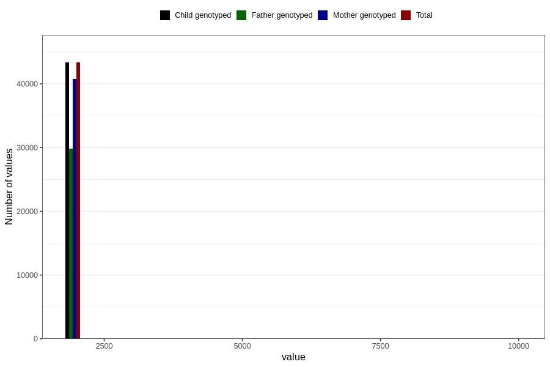

# q3y_year_filled
Variable mapping to `GG11` in `Skjema6_3aar_v12`.
- Number of values:

| Value | Total | Child genotyped | Mother genotyped | Father genotyped |
| ----- | ----- | --------------- | ---------------- | ---------------- |
| Missing | 37456 | 37456 | 35250 | 23285 |
| Non-missing | 43350 | 43350 | 40774 | 29878 |
| 2001 | 5 | 5 | 3 | 2 |
| 2002 | 16 | 16 | 15 | 10 |
| 2003 | 17 | 17 | 17 | 11 |
| 2004 | 819 | 819 | 790 | 321 |
| 2005 | 3776 | 3776 | 3607 | 2117 |
| 2006 | 5982 | 5982 | 5658 | 3989 |
| 2007 | 6248 | 6248 | 5880 | 4344 |
| 2008 | 6573 | 6573 | 6130 | 4674 |
| 2009 | 7153 | 7153 | 6714 | 5273 |
| 2010 | 6028 | 6028 | 5592 | 4249 |
| 2011 | 5266 | 5266 | 4994 | 3816 |
| 2012 | 1449 | 1449 | 1356 | 1061 |
| 2013 | 5 | 5 | 5 | 2 |
| 2014 | 1 | 1 | 1 | 1 |
| 9999 | 12 | 12 | 12 | 8 |

