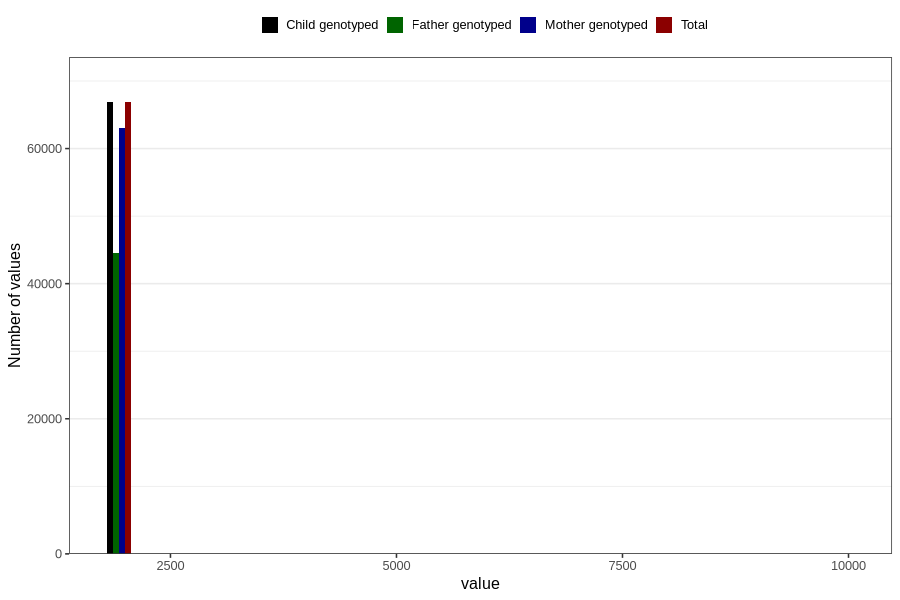

# q4_year_filled
Variable mapping to `DD11` in `Skjema4_6mnd_v12`.
- Number of values:

| Value | Total | Child genotyped | Mother genotyped | Father genotyped |
| ----- | ----- | --------------- | ---------------- | ---------------- |
| Missing | 13906 | 13906 | 12971 | 8527 |
| Non-missing | 66900 | 66900 | 63053 | 44636 |
| 2000 | 641 | 641 | 616 | 119 |
| 2001 | 1788 | 1788 | 1735 | 475 |
| 2002 | 4048 | 4048 | 3909 | 1751 |
| 2003 | 7103 | 7103 | 6735 | 4506 |
| 2004 | 8895 | 8895 | 8389 | 6008 |
| 2005 | 9140 | 9140 | 8586 | 6411 |
| 2006 | 10898 | 10898 | 10177 | 7892 |
| 2007 | 9531 | 9531 | 8935 | 6868 |
| 2008 | 9147 | 9147 | 8577 | 6418 |
| 2009 | 5636 | 5636 | 5326 | 4144 |
| 2010 | 21 | 21 | 20 | 15 |
| 2022 | 1 | 1 | 1 | 1 |
| 2066 | 1 | 1 | 1 | 1 |
| 9999 | 50 | 50 | 46 | 27 |

