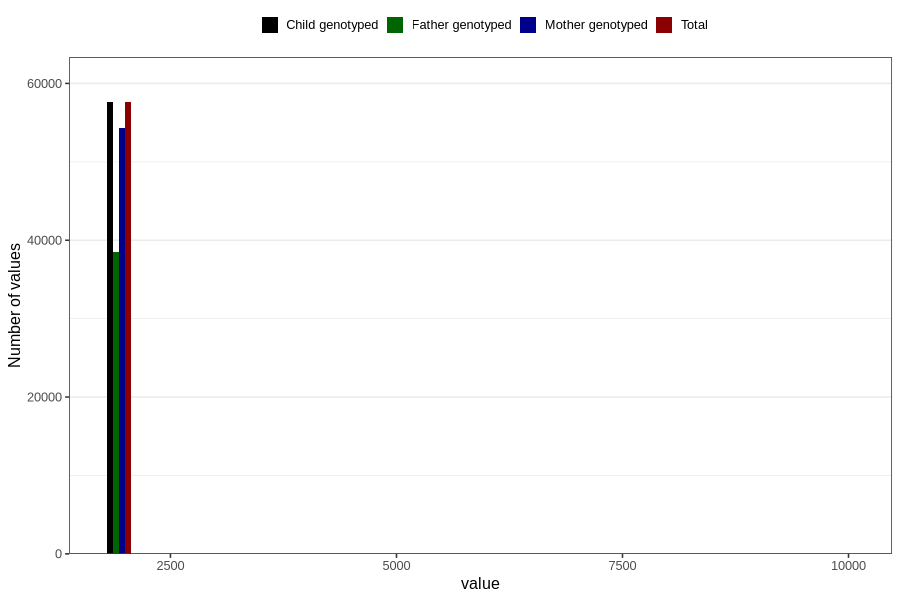

# q5_year_filled
Variable mapping to `EE11` in `Skjema5_18mnd_v12`.
- Number of values:

| Value | Total | Child genotyped | Mother genotyped | Father genotyped |
| ----- | ----- | --------------- | ---------------- | ---------------- |
| Missing | 23176 | 23176 | 21707 | 14687 |
| Non-missing | 57630 | 57630 | 54317 | 38476 |
| 2000 | 7 | 7 | 7 | 3 |
| 2001 | 387 | 387 | 373 | 89 |
| 2002 | 1756 | 1756 | 1702 | 449 |
| 2003 | 3578 | 3578 | 3459 | 1550 |
| 2004 | 6171 | 6171 | 5836 | 3906 |
| 2005 | 7887 | 7887 | 7438 | 5357 |
| 2006 | 7674 | 7674 | 7218 | 5385 |
| 2007 | 9333 | 9333 | 8709 | 6788 |
| 2008 | 8216 | 8216 | 7703 | 5939 |
| 2009 | 7811 | 7811 | 7336 | 5499 |
| 2010 | 4734 | 4734 | 4468 | 3463 |
| 2011 | 39 | 39 | 33 | 28 |
| 9999 | 37 | 37 | 35 | 20 |

