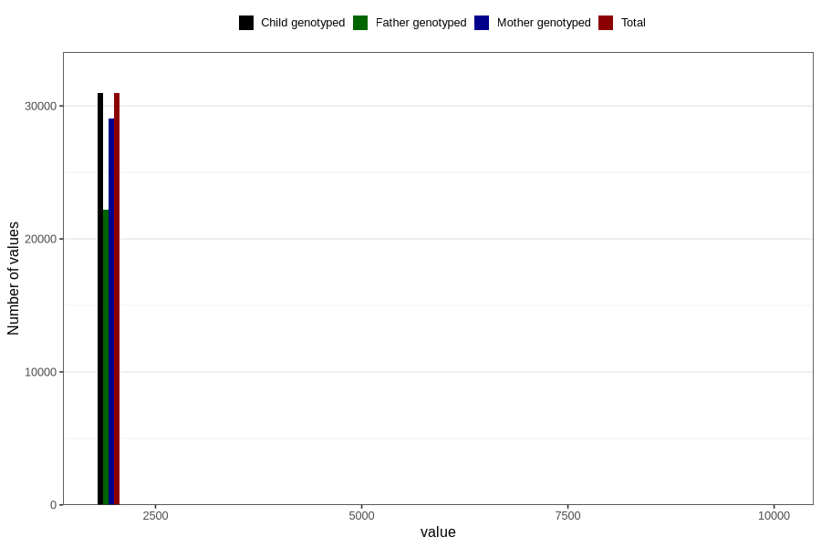

# q5y_year_filled
Variable mapping to `LL11` in `Skjema5aar_v12`.
- Number of values:

| Value | Total | Child genotyped | Mother genotyped | Father genotyped |
| ----- | ----- | --------------- | ---------------- | ---------------- |
| Missing | 49844 | 49844 | 46952 | 30989 |
| Non-missing | 30962 | 30962 | 29072 | 22174 |
| 2001 | 4 | 4 | 3 | 3 |
| 2003 | 1 | 1 | 1 | 1 |
| 2004 | 19 | 19 | 16 | 13 |
| 2005 | 22 | 22 | 20 | 19 |
| 2006 | 16 | 16 | 14 | 10 |
| 2007 | 21 | 21 | 21 | 15 |
| 2008 | 14 | 14 | 14 | 7 |
| 2009 | 14 | 14 | 14 | 11 |
| 2010 | 11471 | 11471 | 10779 | 8088 |
| 2011 | 6866 | 6866 | 6480 | 5048 |
| 2012 | 5224 | 5224 | 4820 | 3661 |
| 2013 | 5495 | 5495 | 5199 | 3949 |
| 2014 | 1776 | 1776 | 1673 | 1336 |
| 2015 | 5 | 5 | 5 | 2 |
| 2016 | 1 | 1 | 1 | 1 |
| 2017 | 1 | 1 | 1 | 1 |
| 2018 | 1 | 1 | 1 | 1 |
| 2021 | 1 | 1 | 1 | 1 |
| 9999 | 10 | 10 | 9 | 7 |

