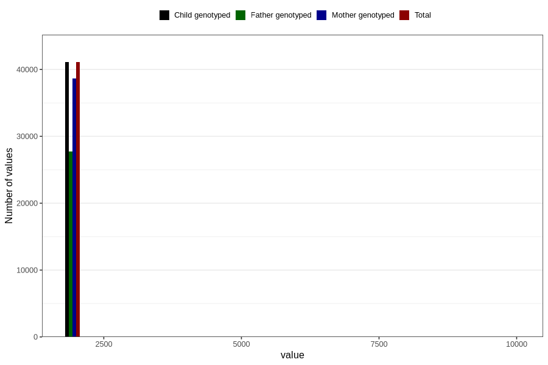

# q7y_year_filled
Variable mapping to `JJ11` in `Skjema7aar_v12`.
- Number of values:

| Value | Total | Child genotyped | Mother genotyped | Father genotyped |
| ----- | ----- | --------------- | ---------------- | ---------------- |
| Missing | 39713 | 39713 | 37325 | 25434 |
| Non-missing | 41093 | 41093 | 38699 | 27729 |
| 25th percentile | 2011 | 2011 | 2010 | 2011 |
| 50th percentile | 2012 | 2012 | 2012 | 2013 |
| 75th percentile | 2014 | 2014 | 2014 | 2014 |
| Mean | 2013.75754994768 | 2013.75754994768 | 2013.63353058219 | 2014.15229543078 |
| Standard deviation | 111.45157886182 | 111.45157886182 | 107.432631167471 | 117.490754792203 |
| N | 41093 | 41093 | 38699 | 27729 |

