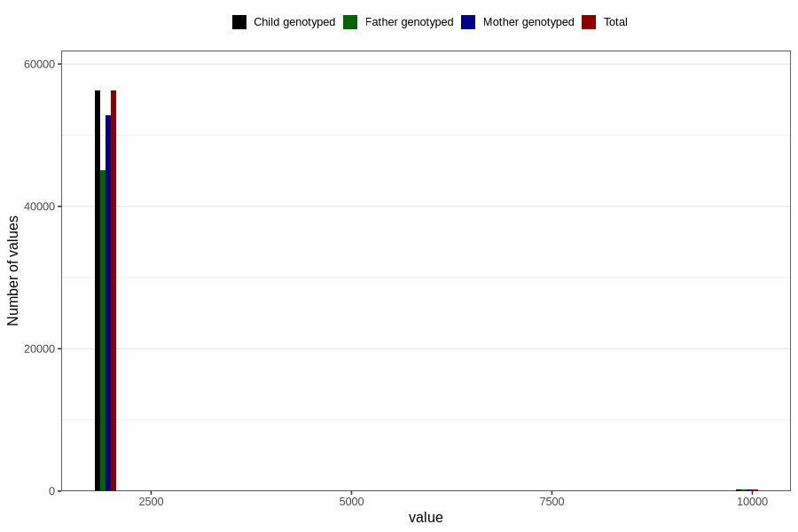

# qFar_year_filled
Variable mapping to `FF11` in `SkjemaFar_v12`.
- Number of values:

| Value | Total | Child genotyped | Mother genotyped | Father genotyped |
| ----- | ----- | --------------- | ---------------- | ---------------- |
| Missing | 24275 | 24275 | 23010 | 7853 |
| Non-missing | 56531 | 56531 | 53014 | 45310 |
| 2000 | 4 | 4 | 4 | 3 |
| 2001 | 967 | 967 | 924 | 782 |
| 2002 | 5332 | 5332 | 5017 | 4246 |
| 2003 | 7547 | 7547 | 7099 | 5973 |
| 2004 | 8507 | 8507 | 7974 | 6781 |
| 2005 | 10438 | 10438 | 9727 | 8341 |
| 2006 | 9112 | 9112 | 8525 | 7448 |
| 2007 | 8622 | 8622 | 8079 | 6830 |
| 2008 | 5637 | 5637 | 5320 | 4616 |
| 2009 | 83 | 83 | 81 | 67 |
| 9999 | 282 | 282 | 264 | 223 |

