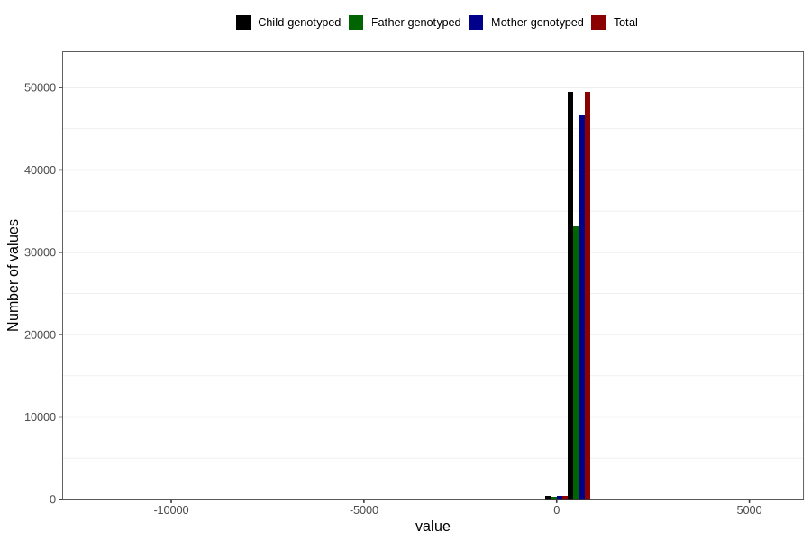

# age_15_18m_1
Variable mapping to `Q5_AGE_15_18_M` in `Skjema5_18mnd_v12`.
- Number of values:

| Value | Total | Child genotyped | Mother genotyped | Father genotyped |
| ----- | ----- | --------------- | ---------------- | ---------------- |
| Missing | 30931 | 30931 | 28991 | 19684 |
| Non-missing | 49875 | 49875 | 47033 | 33479 |
| 25th percentile | 461 | 461 | 461 | 460 |
| 50th percentile | 474 | 474 | 474 | 473 |
| 75th percentile | 512 | 512 | 512 | 510 |
| Mean | 485.167338345865 | 485.167338345865 | 485.340718219123 | 484.830640102751 |
| Standard deviation | 108.49421909363 | 108.49421909363 | 102.306075393373 | 83.6338464968989 |
| N | 49875 | 49875 | 47033 | 33479 |

