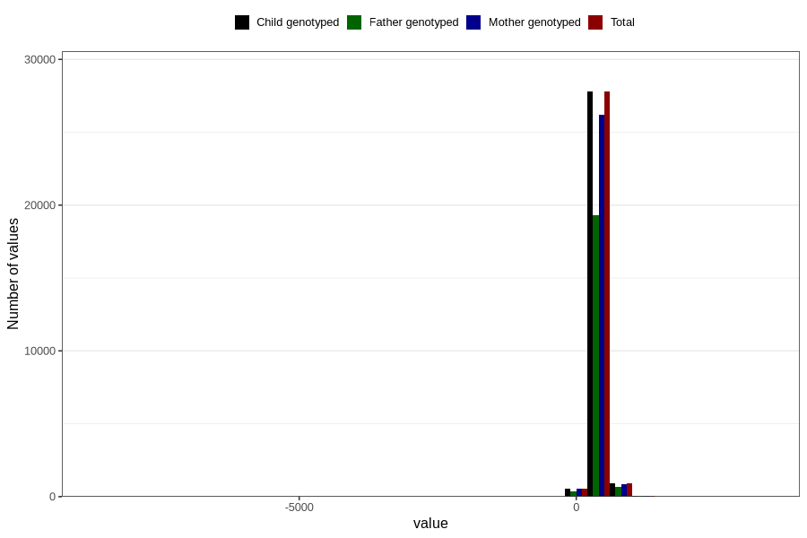

# age_15_18m_2
Variable mapping to `Q6_AGE_18_M` in `Skjema6_3aar_v12`.
- Number of values:

| Value | Total | Child genotyped | Mother genotyped | Father genotyped |
| ----- | ----- | --------------- | ---------------- | ---------------- |
| Missing | 51434 | 51434 | 48323 | 32798 |
| Non-missing | 29372 | 29372 | 27701 | 20365 |
| 25th percentile | 459 | 459 | 459 | 459 |
| 50th percentile | 474 | 474 | 474 | 473 |
| 75th percentile | 527 | 527 | 527 | 523 |
| Mean | 488.452165327523 | 488.452165327523 | 488.272986534782 | 487.595089614535 |
| Standard deviation | 111.592556967899 | 111.592556967899 | 112.241569948028 | 116.442230829936 |
| N | 29372 | 29372 | 27701 | 20365 |

