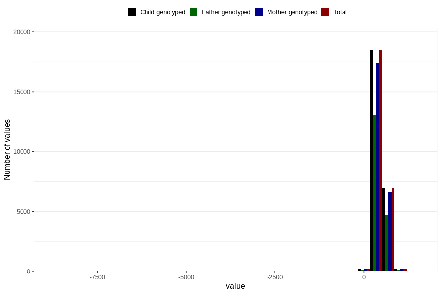

# age_16m
Variable created during phenotype curation.
- Number of values:

| Value | Total | Child genotyped | Mother genotyped | Father genotyped |
| ----- | ----- | --------------- | ---------------- | ---------------- |
| Missing | 54853 | 54853 | 51534 | 35096 |
| Non-missing | 25953 | 25953 | 24490 | 18067 |
| 25th percentile | 460 | 460 | 460 | 459.5 |
| 50th percentile | 474 | 474 | 474 | 473 |
| 75th percentile | 527 | 527 | 527 | 523 |
| Mean | 489.226447809502 | 489.226447809502 | 489.166721110657 | 488.48131953285 |
| Standard deviation | 108.141172476445 | 108.141172476445 | 108.993943429272 | 114.227753435387 |
| N | 25953 | 25953 | 24490 | 18067 |

