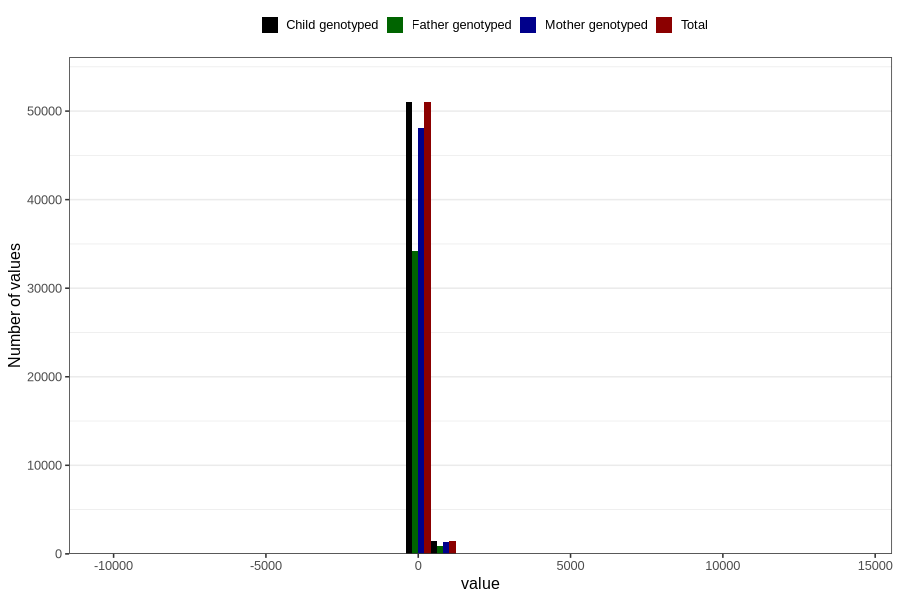

# age_1y
Variable mapping to `Q5_AGE_1_Y` in `Skjema5_18mnd_v12`.
- Number of values:

| Value | Total | Child genotyped | Mother genotyped | Father genotyped |
| ----- | ----- | --------------- | ---------------- | ---------------- |
| Missing | 28344 | 28344 | 26561 | 18019 |
| Non-missing | 52462 | 52462 | 49463 | 35144 |
| 25th percentile | 363 | 363 | 363 | 363 |
| 50th percentile | 369 | 369 | 369 | 369 |
| 75th percentile | 377 | 377 | 377 | 377 |
| Mean | 370.508444207236 | 370.508444207236 | 370.580979722217 | 370.919274982927 |
| Standard deviation | 89.3137500907118 | 89.3137500907118 | 91.4615326149629 | 85.0871106970394 |
| N | 52462 | 52462 | 49463 | 35144 |

